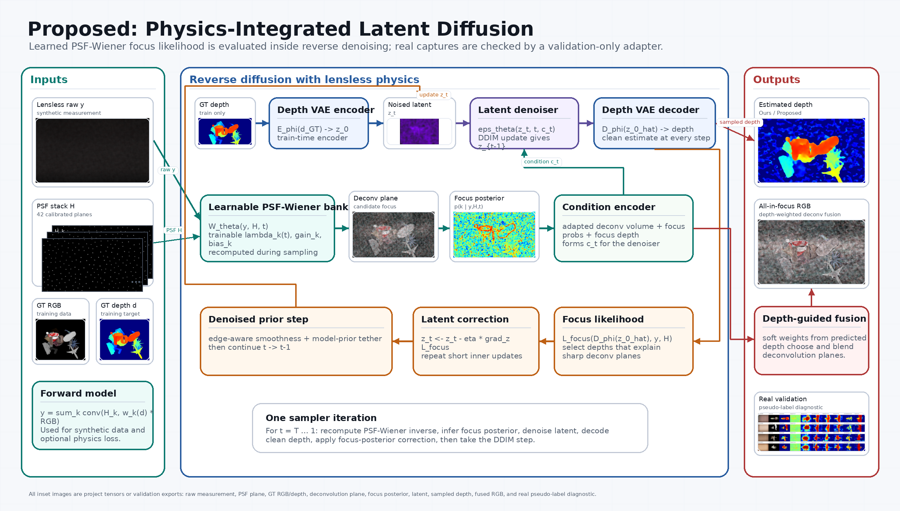
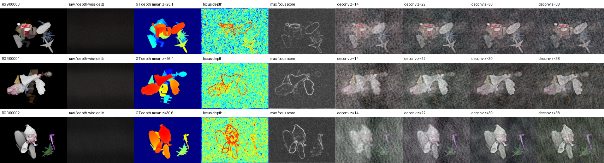

# Poster: Lensless Depth Diffusion

## Metadata

- Project: `lensless-depth-diffusion`
- Venue: final graphics project poster
- Orientation: landscape
- Output PDF: `exports/poster-prelim-2026-06-04.pdf`
- HTML archive: `https://donggeonbae.github.io/presentation/projects/lensless-depth-diffusion-poster/`
- Related research: `../research/notes/lensless-depth-diffusion/final-model-status-2026-06-04.md`
- Related figures: `../figure/figures/lensless-depth-diffusion/figure-set-2026-06-04.md`
- Current status: refreshed with final `Ours / Proposed` full-6k aggregate, rebuilt architecture figure, and explicit real-validation panel.

## Poster Message

Lensless depth estimation depends on depth-dependent PSF focus. `Ours / Proposed` demonstrates how to move PSF-Wiener deconvolution and focus likelihood into latent diffusion reverse sampling instead of treating deconvolution as a fixed preprocessing stage.

## Layout Plan

| Region | Purpose | Content | Visual |
| --- | --- | --- | --- |
| Background | Motivate physics-aware depth | 42-plane PSF stack and synthetic lensless raw generation | PSF/raw/RGB/depth thumbnails |
| Method | Explain Ours | Latent VAE, denoising U-Net, learnable PSF-Wiener bank, focus likelihood, latent correction | Architecture figure |
| Results | Show evidence | Physics-only, supervised baselines, `Ours / Proposed`, real pseudo diagnostic | Metric table, qualitative panel, and real-validation panel |
| Takeaway | Set expectations | Ours is policy-correct diffusion, not the highest supervised metric row | Findings box |

## Current Visuals

### Architecture

### Deconvolution Focus Planes

### Depth Result Panel

### Real Validation Panel

## Final Results

| Method | Eval | fg delta1 | fg delta3 | fg MAE |
| --- | ---: | ---: | ---: | ---: |
| Physics focus | 6k | 0.391 | 0.816 | 0.214 |
| Raw U-Net, 66k | 6k | 0.436 | 0.753 | 0.204 |
| Deconv U-Net, 66k | 6k | 0.865 | 0.949 | 0.050 |
| Deconv U-Net + affine | 6k | 0.881 | 0.968 | 0.046 |
| Earlier integrated LDM | 6k | 0.878 | 0.948 | 0.059 |
| **Ours / Proposed** | 6k | **0.896** | **0.932** | **0.050** |

## Presenter Script

### 30-Second Version

This project estimates depth from a lensless measurement and a 42-plane PSF stack. The important cue is that different deconvolution planes focus different depths. Our final method samples depth in latent diffusion while repeatedly evaluating a learnable PSF-Wiener focus likelihood inside the reverse loop. On the full 6k test set, `Ours / Proposed` reaches foreground delta1 0.896, delta3 0.932, and MAE 0.050.

### 2-Minute Version

Lensless raw images mix spatial content and depth-dependent blur. A pure supervised model can learn from a deconvolution stack, but the project goal was different: put the physics inside the diffusion process. `Ours / Proposed` uses a depth VAE, a latent denoising U-Net, a timestep-conditioned PSF-Wiener bank, and a focus likelihood that corrects the latent state during reverse diffusion. The model improves over physics-only focus scoring and produces cleaner depth than earlier noisy diffusion outputs, but it still trails direct supervised baselines on loose delta3. The real-data diagnostic shows why learnable deconvolution matters for measured captures: fixed inverse filtering creates artifacts that need adaptation.

## Questions and Answers

| Question | Answer |
| --- | --- |
| Is this just deconvolution plus a U-Net? | No. The final model evaluates a learnable PSF-Wiener focus likelihood inside latent reverse sampling. |
| Why is the supervised teacher not Ours? | The project objective is physics-integrated diffusion. The teacher is an upper-bound baseline. |
| Did Ours reach 98%? | No. Final full-6k delta3 is 0.932; the 98% target remains unmet. |
| Why use z=14,22,30,38 in the figure? | Early deconvolution planes were visually weak, so the figure uses mid/late planes that actually show focus differences. |

## Export Checklist

- Poster PDF rebuilt with the final metric table and real-validation panel.
- Architecture figure replaced with the deterministic proposed architecture figure, including the validation-only RealAdapt diagnostic block.
- Qualitative panel uses RGB, GT depth, physics focus, and Ours only.
- Public poster HTML should be overwritten at the same Pages URL.
