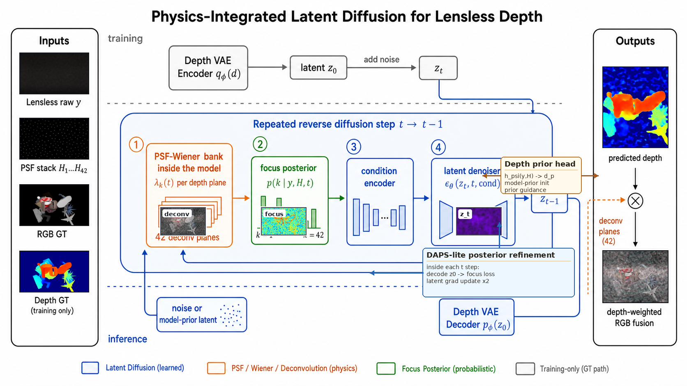
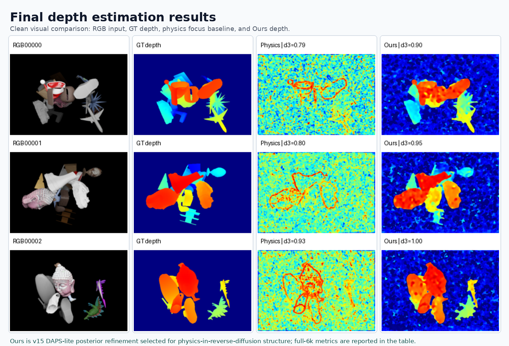

# Poster: Lensless Depth Diffusion

## Metadata

- Project: `lensless-depth-diffusion`
- Conference or venue: final graphics project poster
- Poster size: digital poster draft; current PDF export uses the working project layout
- Orientation: landscape
- Audience: course project reviewers and imaging/graphics researchers
- Output PPTX: not generated yet
- Output PDF: `exports/poster-prelim-2026-06-04.pdf`
- Related manuscript: `../writing/manuscripts/lensless-depth-diffusion/`
- Related figures: `../figure/figures/lensless-depth-diffusion/figure-set-2026-06-04.md`
- Related reviews: none yet
- Related research: `../research/notes/lensless-depth-diffusion/final-model-status-2026-06-04.md`

## Poster Message

PSF-stack deconvolution creates a depth-dependent focus volume, and a latent diffusion model can use that physics during sampling to recover depth from synthetic lensless measurements. The current final method is `Ours v15`, a physics-integrated latent diffusion model with DAPS-lite posterior guidance.

## Layout Plan

| Region | Purpose | Content | Visual |
| --- | --- | --- | --- |
| Title | State contribution quickly | Physics-Integrated Latent Diffusion for Lensless Depth Estimation | none |
| Background | Motivate physics-aware depth | Lensless measurements encode depth through PSF-dependent blur and focus | PSF/deconv focus planes |
| Method | Explain Ours | Latent depth autoencoder, denoising UNet, deconvolution/focus posterior guidance | Architecture figure |
| Results | Show current evidence | Physics-only vs Ours metrics and qualitative depth | Clean depth panel |
| Takeaway | Set expectations | Ours beats physics-only; final 5epoch full-test evaluation is pending | concise table |

## Required Text

### Title

Physics-Integrated Latent Diffusion for Lensless Depth Estimation

### Authors and Affiliations

Donggeon Bae, Hojin Jang. Course/project affiliation should be checked before final export.

### Abstract or Summary

We study depth estimation from synthetic lensless measurements generated with a 42-plane PSF stack. Rather than using deconvolution only as a preprocessing step, the selected model integrates PSF-stack Wiener deconvolution, focus probabilities, and posterior guidance into a latent diffusion depth model. Preliminary full-test results show large gains over a physics-only focus/deconvolution baseline, while final 5epoch evaluation is still running.

### Method

Ours v15 encodes depth into latent space, denoises latent depth using a conditional diffusion model, and decodes the result into a dense depth map. The condition is a PSF-stack deconvolution volume augmented with focus probabilities, depth hints, and auxiliary focus features. During reverse diffusion, DAPS-lite posterior guidance steers samples toward deconvolution/focus consistency.

### Results

Current full-test evidence uses the 195k-step v15 checkpoint. Ours improves foreground delta3 from 0.816 for the physics-only focus baseline to 0.930, and reduces foreground MAE from 0.214 to 0.0567. The 225k and final 330k full-test evaluations are pending and should replace these numbers when complete.

### Conclusion

The preliminary evidence supports the main claim that depth-dependent deconvolution features are useful physics cues for latent diffusion depth estimation. The final conclusion should be updated after the full 6,000-sample evaluation of the converged checkpoint.

## Figure Requirements

- Architecture figure with latent encoder/decoder and reverse-diffusion guidance.
- Deconvolution focus planes from z=14..41, not z=0 or z=7.
- Clean qualitative depth panel with RGB, GT, physics-only, and Ours.
- One compact metric table. Do not use the supervised teacher as `Ours`.

## Current Visuals

### Architecture

### Deconvolution Focus Planes

### Depth Result Panel

## Presenter Script

### 30-Second Version

This project estimates depth from lensless measurements using a 42-plane PSF stack. The key point is that different deconvolution planes focus different depths, so we treat the deconvolution stack as physics evidence inside a latent diffusion model. Ours v15 is the final diffusion model family: it uses latent denoising plus deconvolution/focus posterior guidance. Preliminary full-test results beat the physics-only focus baseline, and the final 5epoch full-test evaluation is running.

### 2-Minute Version

Lensless measurements mix spatial content and depth-dependent blur. If we deconvolve the same measurement with different PSF planes, different scene regions become sharper depending on depth. A plain pipeline would feed that deconvolution stack into a supervised UNet, but our goal is to put the physics into the diffusion process. Ours v15 encodes depth into latent space, denoises the latent depth, and conditions/guides reverse diffusion using PSF-stack deconvolution, focus probabilities, and auxiliary focus cues. In the current full-test result, Ours improves foreground delta3 from 0.816 for physics-only focus scoring to 0.930, with foreground MAE dropping from 0.214 to 0.0567. We are running the final 5epoch evaluation to decide whether the later checkpoint or the 195k checkpoint is the final reported model.

### Detailed Walkthrough

Start with the deconvolution focus figure: it shows why the stack matters. Move to the architecture: depth is sampled in latent space while deconvolution and focus features guide the reverse process. Then show the qualitative result panel: physics-only focus gives rough structure, while Ours is cleaner and closer to GT. Close by stating that the final model is selected by the diffusion policy, not by choosing the strongest supervised teacher.

## Questions and Answers

| Question | Answer |
| --- | --- |
| Is this just deconvolution plus a UNet? | No. The final Ours family is latent diffusion with deconvolution/focus conditioning and posterior guidance during sampling. |
| Why not call the supervised teacher Ours? | The project goal is physics-integrated diffusion. The teacher is a baseline or upper bound, not the target method. |
| Are the final numbers done? | Not yet. Current paper/poster numbers are preliminary 195k full-test results; 225k and 330k full-test evaluations are running or scheduled. |
| Why omit z=0 and z=7 deconvolution planes? | Visual checks showed those planes were not useful for illustrating focus behavior, so the poster uses mid/late planes. |

## Print and Export Checklist

- Replace preliminary metrics after final full-6k evaluation.
- Regenerate clean depth result panel from the selected final checkpoint.
- Keep all text readable from poster viewing distance.
- Use concise method labels and avoid long version names in the poster body.
- Export updated poster PDF and optionally PPTX.
